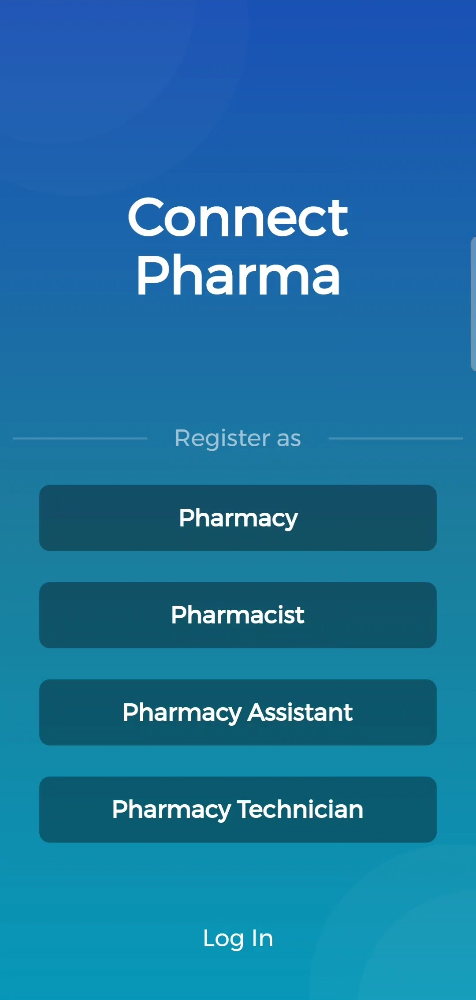
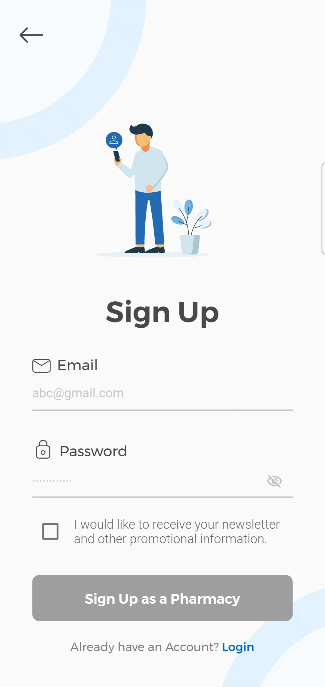
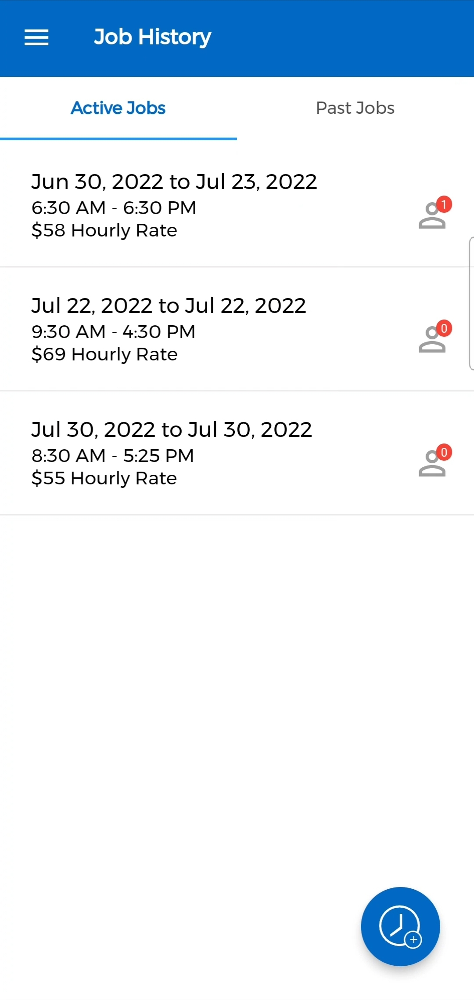
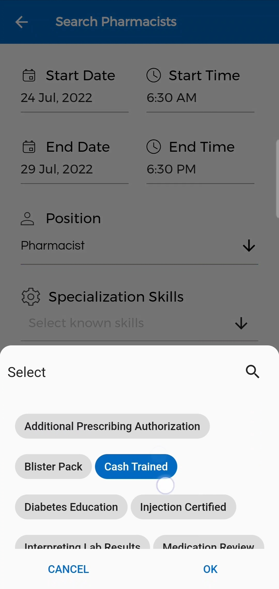

## ConnectPharma
An app to help connect Pharmacies looking for relief Pharmacists and Pharmacists looking for jobs.

## Project Images
   

## Requirments
- Firebase Project Setup
    - More Info (https://firebase.google.com/docs/flutter/setup?platform=android)
- Flutter Installed in system

## How to Use

**Please Read**
I see great value keeping my app open source contributing to the open source community and allowing others to learn, growing as developers experimenting with other projects.

If you would like to use the code from this project, you are free to do so but please provide credit. A lot of work was put into designing and programming for this project. As you know plagirism is bad and finding out someone copied my app, claiming it as their own would be disheartening. Additionally, this project is not setup to be used as a template at all. You are welcome to have a look and nitpick, but DO NOT use as a template for your own project, it will only hinder your learning and cause unneeded stress.

**Step 1:**

Download or clone this repo by using the link below:

```
https://github.com/sgarg15/ConnectPharma.git
```

**Step 2:**

Configure .env file in the root of the project
```
ANDROID_API_KEY = Key
GOOGLE_MAPS_API_KEY = Key
```

**Step 3:**

Go to project root and execute the following command in console to get the required dependencies: 

```
flutter pub get 
```

**Step 4:**

Run flutter project (The project will run, but the main functionality will only be functional once Firebase is setup):

```
flutter run
```
